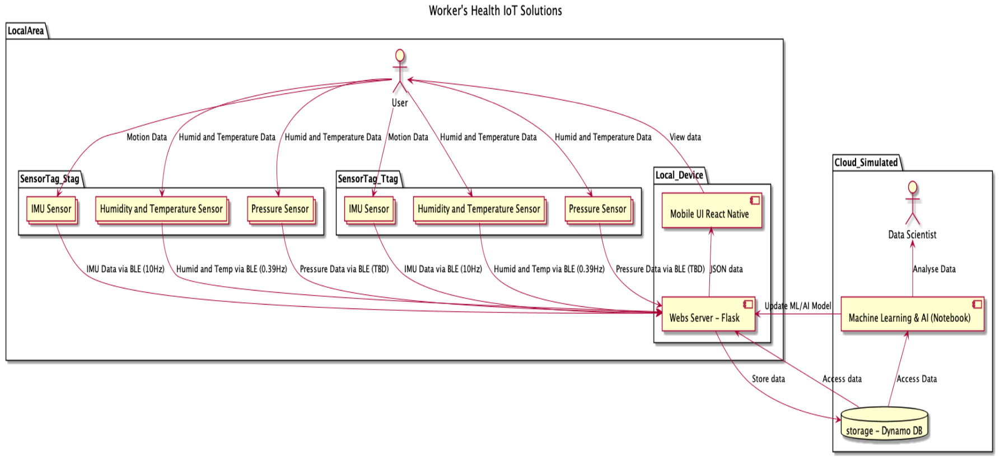
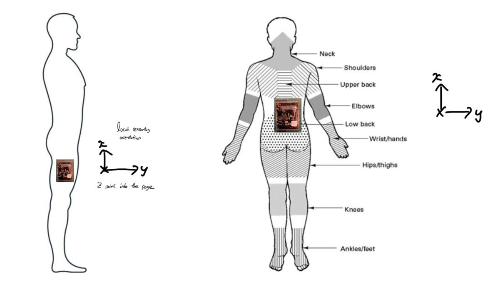
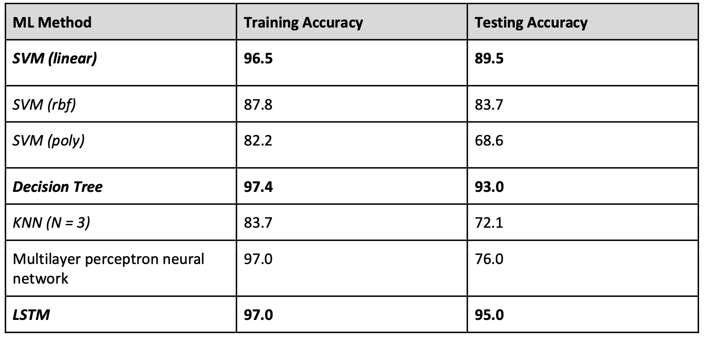
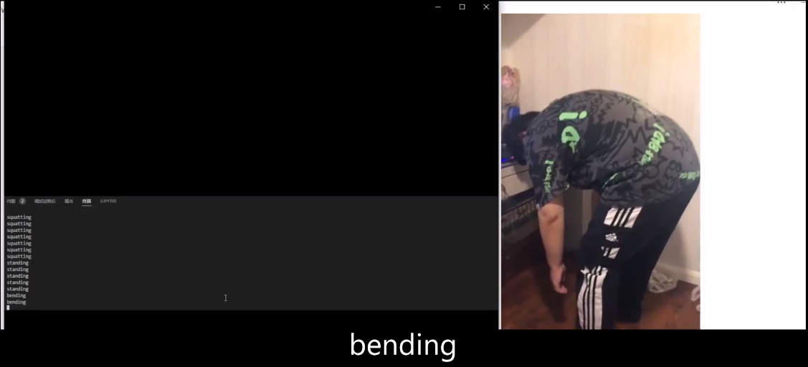
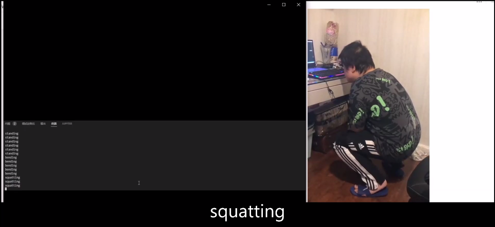

# MIT_IoT_project

## Summary : The development of a construction worker safety detection and monitoring system

- This project was for an IoT course
- I came up with the idea of the project, after reading several published papers on google scholar (which can be found in the references of the report)
- A project with 4 members, I mostly worked on the ata collection, data preprocessing, machine learning and results component.

- Goal: Develop a system, which can help detect and monitor the work-related musculoskeletal disorder (WMSD) risk of construction or office workers. We used two sensor tags to determine and analyse the dynamic posture, as well as track the safety of the surrounding environment, by measuring the linear and angular acceleration, magnetic field strength, humidity, temperature and pressure.

- Solution Architecture : 

  

  
## What we did :
In short, we collected raw IMU data from the two sensortags with BLE, and needed to classify the position type (squatting, bending , standing ) of the user in live time, whilst monitoring the temperature, air pressure, and the humidity of the environment.

 

- ### Data Acquisition (BLE, Python Flask, DynamoDB )
As this part was mainly done by two other members, more information can be read in the report.

 

- ### Data Collection

Here we followed a strict protocol, with the TI sensortags applied as according.

  

 

- ### Data Preprocessing:
    - Applied feature engineering on the raw IMU data from both sensors
    - Applied signal preprocessing to remove noise from data
    - Applied a sliding window technique over the data

 

- ### Machine Learning:
    - I tested several models : SVM, DT, KNN, multilayer perceptron
    - One of my other groupmate applied the LSTM model

    - These were the accuracy results of the ML model: 

  

As you can see, the best accuracy scores for training and testing were in the mid 90's from the LSTM.

 

My contribution:
My own personal work can be found in IoT_project.ipynb. Where I helped with the data collection (designing the protocol, collected data etc), did the preprocessing, created and tuned several ML models, and applied the best model to predict the motion in live-time.

  
- ### Live-time output:

  
  

 
Further information can be read in our report.